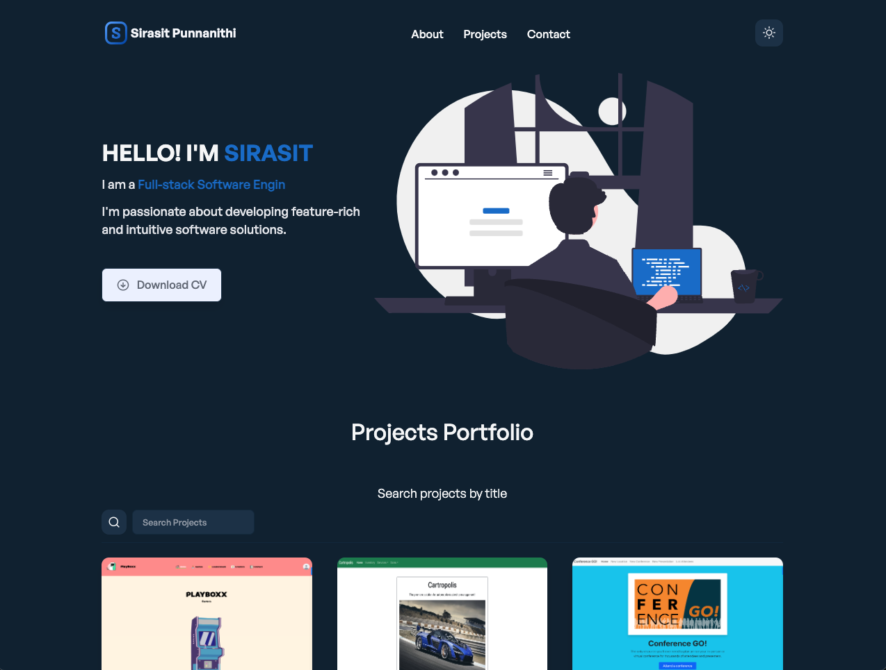

# React & TailwindCSS Portfolio - With Dark/Light Mode

My personal portfolio built with React and Tailwind CSS.



## Demo URL

[https://punnanithi-portfolio.vercel.app/](https://punnanithi-portfolio.vercel.app/)

## Features

- [React v18](https://reactjs.org) with [React Router v6](https://reactrouter.com)
- [Tailwind CSS v3](https://tailwindcss.com)
- [EmailJS](https://www.emailjs.com)
- Context API For State Management
- Custom Hooks
- Unit Testing
- Framer Motion transitions & animations
- [React Typing Animation](https://www.npmjs.com/package/react-type-animation)
- Reusable components
- Dark/light mode
<!-- - Projects filter by category -->
- Projects filter by search
- Smooth scroll
<!-- - Counter -->
- Dynamic forms
- Back to top button
- Download file button
- Simple and responsive design

## Setup

1. Make sure you have Node JS installed. If you don't have it:

- [Download it from nodejs.org](https://nodejs.org)
- [Install it using NVM ](https://github.com/nvm-sh/nvm)
- If you're on Mac, Homebrew is a good option too:

```
brew install node
```

2. Clone the repo:

```
git clone https://github.com/spunnanithi/portfolio-react-tailwind.git
```

3. Open the project folder:

```
cd portfolio-react-tailwindcss
```

4. Install packages and dependencies:

```
yarn
```

> NOTE: If you don't have yarn installed, you can install it globally using npm:
>
> ```
> npm install --global yarn
> ```

5. Start a local dev server at `http://localhost:3000`:

```
yarn start
```

6. Run tests:

```
yarn test
```

## Notes

- Illustrations from [unDraw](https://undraw.co) and [Freepik](https://freepik.com)
- Images from [Unsplash](https://unsplash.com)
- SVG images from [SVGRepo](https://www.svgrepo.com/)
- Icons from [React Icons](https://react-icons.github.io/react-icons/)

### License

[MIT](https://github.com/realstoman/react-tailwindcss-portfolio/blob/main/LICENSE)
